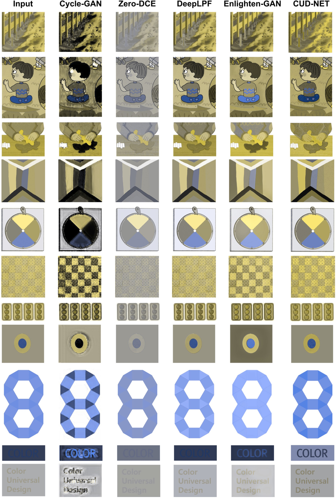

# CUD-NET: Color Universal Design Neural Filter for the Color Weakness

This repository is the official implementation of [CUD-NET: Color Universal Design Neural Filter for
the Color Weakness](https://arxiv.org/abs/2030.12345).

Sunyong Seo, Hana Kim, Jinho Park

# Notice
- As our train dataset is exclusive to cooperation institutes, only part of the inference dataset can be released.
- The HSV conversion algorithm has defunction of resversing Hue on the value with 180.
- We used extra training data on up-loaded model, so there would be some error comparing to papers'

## Requirements

To install requirements:

```setup
pip install -r requirements.txt
```

## Training and Evaluation

```
python main.py --log_interval 100 --save_interval 10 -cuda -pin_memory --mode train --worker 8
python test_image.py -cuda -pin_memory --worker 2 --mode inference --data_class A
```


## Pre-trained Models

You can find pretrained models on "<i>model_checkpoints/</i>":


## Results




## License

[](https://opensource.org/licenses/MIT)